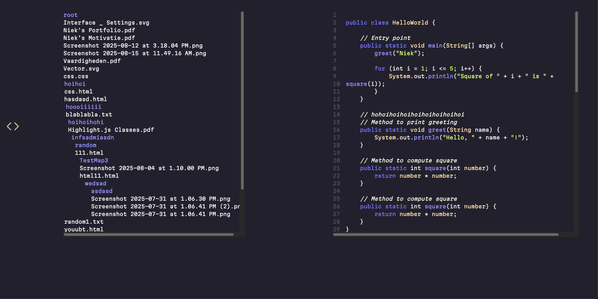

# Web CMS / Niek CMS

a Web-based CMS used with FTP for remote file management. <br/>



When users pull their website through FTP and selected from which folder they want to pull, users then will be able to: add, edit, download, delete & save files just like they would in other editors. <br/>
An automated backup will be made for version control. <br/>
Push will replace all files and folders from the selected path on the remote webhost. <br/>

Pulling will automatically filter files for unwanted file extensions in memory, so will uploading. <br/>

Included is a custom logger with different levels in ASCII, mail service, error handler & more.  <br/>

This project is still being worked on. <br/>

Figma design: https://www.figma.com/design/Gd2qxspnrKTQLjloc0GOSF/Untitled?node-id=2-1712&t=bMNxkeNylUel6EAX-1

## Features

🔗  FTP
---------
• Pull / push files via FTP <br/>
• Local editing <br/>
• Folder management <br/>

📁  Operations
---------
• File editor <br/>
• Adding files & folders <br/>
• Moving files & folders <br/>
• Renaming files & folders <br/>
• Uploading recursively <br/>
• Deleting recursively <br/>
• Downloading recursively <br/>

## Setup

### Database Configuration

```
create a SQL MariaDB database, put connection credentials in .env and Sequalize will handle everything.
```

### FTP Configuration

```
create a custom FTP client for testing with docker or use your own.
add a new User in the database with your FTP credentials.
```

### Run Server

```bash
cd server
```

Make sure to install the dependencies:

```bash
# npm
npm install

# pnpm
pnpm install

# yarn
yarn install
```

Start the development server on `http://localhost:8000`:

```bash
# npm
npm run dev

# pnpm
pnpm run dev

# yarn
yarn dev
```

## Run Frontend

```bash
cd client
```

Make sure to install the dependencies:

```bash
# npm
npm install

# pnpm
pnpm install

# yarn
yarn install
```

Start the development server on `http://localhost:5173`:

```bash
# npm
npm run dev

# pnpm
pnpm run dev

# yarn
yarn dev
```
